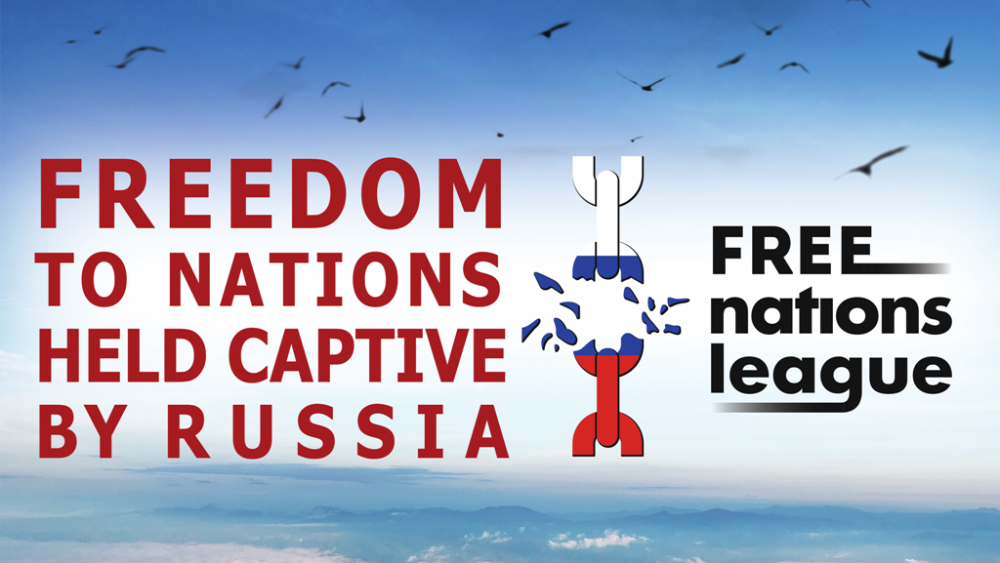

# Activists of the national movement of nations held captive by the Russian Federation will rally in different countries in order to bring the anti-imperial activists all around the world together.

On July 23, the Free Nations League, which brings together representatives of the nations held captive by the Kremlin, will hold peaceful street actions.

No war! Down with the empire! Freedom to the captive nations! Under these slogans, we take to the streets of cities around the world.

We ask the governments of democratic countries to support the right of the non-Russian nations in the Russian Federation to self-determination. The right to restore independence and their own states! The right that was taken from us forcefully!

Lithuania, Vilnius - Cathedral Square, 14:00.

USA, Philadelphia - Philadelphia Museum of Art, 2:00 PM.

USA, Cleveland – Cleveland Downtown “Free Stamp”. 2:00 p.m.

USA, New York City - TBD

We urge you to go to the main squares of your cities demanding that sovereignty be granted to the captive nations and territories in the Russian Federation. If you are ready to organize an action in your city,  contact us: lfn.feedback@gmail.com

***Freedom for Nations! Freedom for Individuals!***

