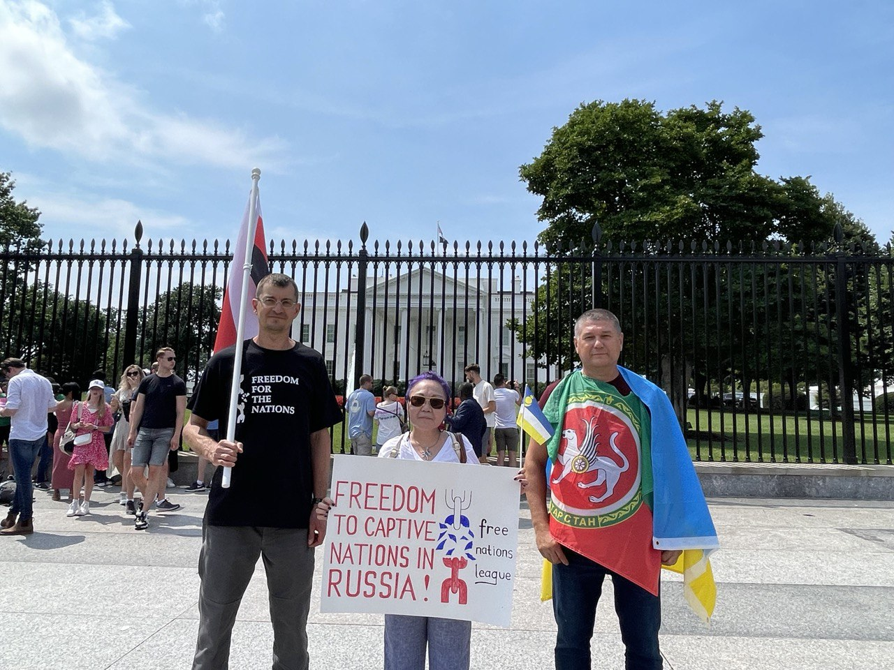

On July 17, the Free Nations League (FNL), which united representatives of nations held captive by the Kremlin, appealed to US President Joe Biden.  In their open letter, activists of national movements ask for support for their peoples in exercising their right to self-determination.

***"By our appeal, we join the Captive Nations Week, which has been held annually in the United States since the adoption of the Resolution by Congress in 1959.  Due to President Biden's visit to the Middle East, and likely in connection with the Russian invasion of Ukraine, the traditional presidential briefing on the White House lawn to open Captive Nations Week has not taken place.  However, we decided to come to Washington anyway, because it is important to state our position and deprive Moscow of its monopoly, which claims to speak undividedly on behalf of our nations.  We do not see the future of our peoples as part of Russia and do not want to be responsible for the war crimes of the Kremlin,"*** says **Vitaly Romashkin**, a representative of the Finno-Ugric people, Erzya.

Vitaly came to Washington together with his colleagues in the Free Nations League - the Buryat **Rajana Dugar-DePonte** and the Tatar **Irshat Khabi**. They hold the Erzya national flag, as well as the flags of Buryatia and Tatarstan.

***"Being Buryat, I am hurted to realize that the Kremlin uses the Buryat guys to achieve its criminal goals - to seize new territories and expand the borders of the empire.  Actually, the war is all that Moscow is able to offer the guys from the Buryat villages. To die like cannon fodder in another Russian conquest war.  I do not wish such a future for Buryatia and my people.  Therefore, today we are here not only to condemn the military aggression against Ukraine, but also to seek support among the American public.  We, the non-Russian nations living in the Russian Federation, are in fact hostages of Moscow and this regime.  We were left with a choice: either fight or go to jail if we do not support Russian aggression,"*** explains Buryat activist **Rajana Dugar-DePonte**.

A tatar political emigrant **Irshat Khabi** shares the League's plans for the next week:

***"On July 20, we will hold an online press conference with members of other national movements that are members of the League (Tatars, Bashkirs, Buryats, Ingrians, Cossacks, Kalmyks, Erzyans) will talk about the goals and objectives of the League, and answer journalists' questions.  Already on July 23, we will go to rallies in different countries of the world, where we will declare our right to self-determination - a right that was taken from us forcefully.  Rallies, in particular, will be in the United States - in New York, Philadelphia and Cleveland.  Today we are in the same position as Ukraine, Estonia, Lithuania or Latvia 40 years ago.  We will strive for decolonization, and in this struggle we need the support of developed democracies."***

The Free Nations League is a broad anti-imperial front of the Bashkir, Buryat, Ingrian, Cossack, Kalmyk, Tatar and Erzya national movements, openly declaring the goal of creating new national states and secession from the Russian Federation.
