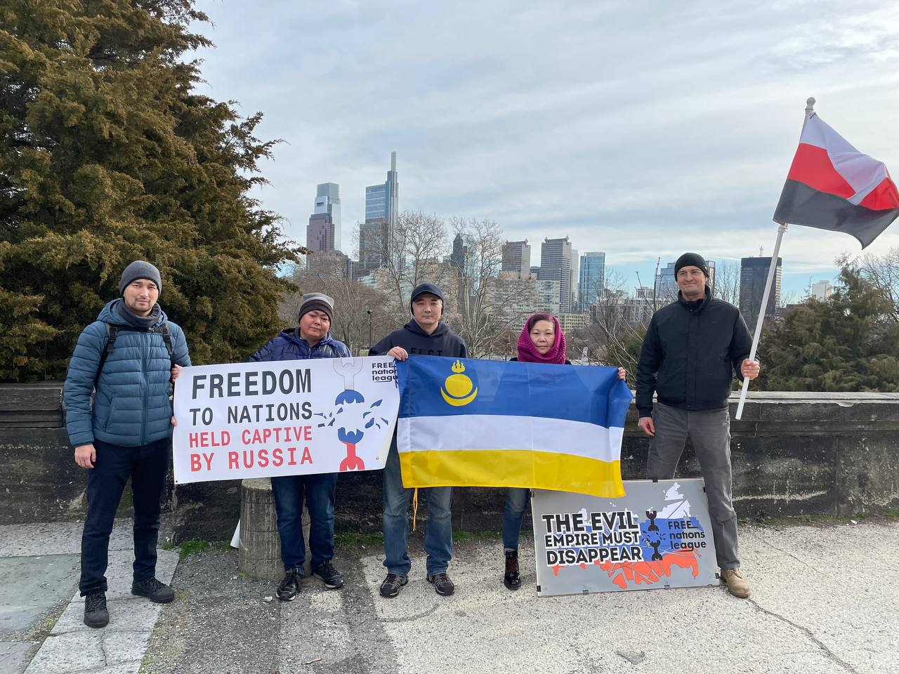
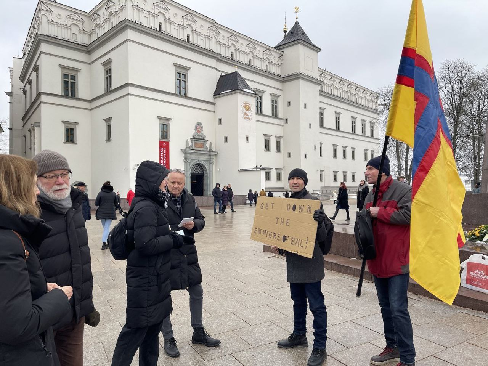

<head>
  <title>Free Kalmykia - We are looking for allies both at home and in exile</title>
  <meta
    name="description"
    content="Free Nations League activists went on protests in the USA and Lithuania to draw international attention to involuntary servitude of captive peoples in the Russian Federation."
    key="desc"
  />
  <meta
    property="og:description"
    content="Free Nations League activists went on protests in the USA and Lithuania to draw international attention to involuntary servitude of captive peoples in the Russian Federation."
  />
  <meta
    name="twitter:description"
    content="Free Nations League activists went on protests in the USA and Lithuania to draw international attention to involuntary servitude of captive peoples in the Russian Federation."
  />
</head>

Free Nations League activists went on protests in the USA and Lithuania to draw international attention to involuntary servitude of captive peoples in the Russian Federation.

“We decided to hold grass root actions. It is important for us to spread our ideas not only online, but also to bring like-minded people to the streets, first here - in exile. We will also seek support among people in democratic countries, primarily among representatives of civil society,” explains the organizer of the action in Philadelphia, Kalmyk Albert Sharapov.

Next to Albert is Buryat journalist Rajana Dugar-DePonte. She came to the rally carrying the flag of Buryatia. “It is important for me that the voice of the Buryats, here in exile, and at home in Buryatia, is heard not only in the context of anti-war actions. After all, the aggression against Ukraine is a consequence of Russia's policy of imperialism. Therefore, the Buryats will stop dying in the interests of others not when this particular war ends, but when our country - Buryatia - becomes independent. The same applies to Kalmyks, Erzya, and representatives of other peoples, whose lands the Russian Federation manages as colonies whose people are just one of the resources.”

Erzya activist Vitaly Romashkin (pictured with the Erzya flag) came to support the action from Cleveland: “Tens of thousands of representatives of our peoples live in the United States. We need to create national diasporas and unite here in America and around the world in order to participate together in actions organized by the Free Nations League! Our mutual cooperation is a very effective way to provide moral support to our peoples, who are now under the colonial  oppression of the Evil Empire and inspire them to fight for their rights, the key of which is the right to self-determination, the right to create their own independent states!  It is time to wake up from the lethargic sleep of oblivion of our own ethnic identity until we are completely dissolved in the gray imperial mass and disappear! We are many and we are strong, the truth is on our side and justice will prevail!”

In Lithuania, Ingrian activist Mike Ingram and Bashkir politician Ruslan Gabbasov attended the protest. “We will repeat again and again that the only possible formula for peace in Eurasia is the decolonization of Russia and the creation of new independent states,” says Mike, who is holding the flag of Ingria.

Ruslan is holding a poster in English: "Let's destroy the evil empire." “Lithuanians come up, ask who we are and what we are trying to achieve, they support us. It is important for us to convey our ideas - we are for the collapse of this empire and for the gaining of freedom by our countries, our peoples. It is important that our voice be heard - that is why we are here. I am addressing both representatives of the diasporas of our peoples, as well as to other caring Lithuanians. Come to the next action on the Cathedral Square of the Lithuanian capital - February 25th. There will be more of us!” Ruslan concludes.

