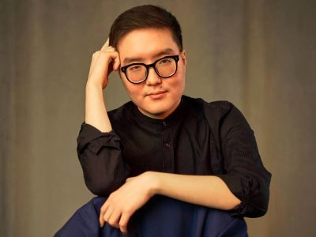

<head>
  <title>They want to go back on February 23rd</title>
  <meta
    name="description"
    content="Daavr Dorzhin: I'd rather be 'with the outcasts and rebels'. Such coverage of the forum of Imperial Russia and the entire discourse of criticism of the regionalist movement testifies to several fundamental theses that guide the so-called 'good Russians'"
    key="desc"
  />
  <meta
    property="og:description"
    content="Daavr Dorzhin: I'd rather be 'with the outcasts and rebels'. Such coverage of the forum of Imperial Russia and the entire discourse of criticism of the regionalist movement testifies to several fundamental theses that guide the so-called 'good Russians'"
  />
  <meta
    name="twitter:description"
    content="Daavr Dorzhin: I'd rather be 'with the outcasts and rebels'. Such coverage of the forum of Imperial Russia and the entire discourse of criticism of the regionalist movement testifies to several fundamental theses that guide the so-called 'good Russians'"
  />
</head>

#### *Daavr Dorzhin: I'd rather be "with the outcasts and rebels"*

Hello Dear Readers! 

My name is Daavr and I am an Oirat. On behalf of the Congress of the Oirat-Kalmyk people, I spoke at the conference on *The Imperial Russia*, organized by the "European Conservatives and Reformers" faction in the European Parliament and at the Forum of Free Peoples of Post-Russia. On the sidelines, journalists from the ‘glad handing’ media of the “all-Russian agenda”, who, with gloomy faces, were observed scribbling furiously on their laptops. Last Friday, almost simultaneously, several materials were published about the conference (in Novaya Gazeta Europe, Meduza, Dozhd, and so on), the general tone of which was reduced to disparaging the speakers and the agenda of Russia's disintegration. Somewhere, very strange phrases were also used: for example, the Bashkort Ruslan Gabbasov was called "an elderly balding man with glasses" in a report by Ilya Azar, who is likewise, an elderly balding man with glasses. The most honest member of the Navalny Team, Vladimir Milov, who does not mislead and says everything that is spinning in his head (which is not the most complimentary nor humane), recorded a big video that says Russia cannot fall apart. For me, such coverage of the forum of *The Imperial Russia* and the entire discourse of criticism of the regionalist movement testifies to several fundamental theses that guide the so-called "good Russians"

#### Thesis number 1. They really believe in Russia "from Kaliningrad to Vladivostok".

The Soviet anthem said that the peoples, subjugated by the imperial authorities, the Bolsheviks and the Communists, *"were rallied forever by Great Russia."* Politicians and public figures of the “all-Russian agenda” (for brevity, we use the term “all-Russians”) consider the entire space of the Russian Federation to be ethnically homogeneous (“Russians are everywhere”), an economically proper territory and which is not subject to disintegration. In their perception, Russia is a single entity, and the people living in Bryansk, Petrozavodsk, Elista and Kyzyl are all one people. How this differs from the concept of late Putinism regarding Ukraine and Belarus is not clear. In addition, the general Russians of Moscow and St. Petersburg are sure that only they, their wisdom and inflexibility, as well as their readiness to use repression, save us, non-Russians, *omnium contra omnes* - all against all. As if we are incapable of agreements or of creating our own states is such a political primordialism.

#### Thesis number 2. They stigmatize us because they can't decide how to deal with our problems.

The rhetoric of the materials mentioned above is aggressive and targets individuals, and is not a fight against the agenda. It should be noted that not all activists and movements of a national persuasion have adopted a policy of secession from Russia. For example, a representative of the Itelmens who was present at the forum called for protecting the indigenous way of life of his people, which is being encroached upon by the brazen business practices of the Moscow metropolis, which violates all possible environmental standards. Nevertheless, all-Russians are trying to erase our differences and create something of us that is unified and convenient for stigmatization and obstruction; how this differs from the propaganda cliché of "Russophobe" or "Russorez" is again not clear. The only funny thing is that there is, in fact, no answer regarding the national question on the agenda of the all-Russians themselves (Team Navalny, Mikhail Khodorkovsky, and so on). Everything should be decided by "parliamentary government". True, so far no one has given an answer as to how to ensure that the rights of the same Itelmens are taken into account in the all-Russian parliament. I can assume that the right of veto for them in the format of the European Council, where France and Germany are forced to conduct extensive negotiations with Poland, Lithuania and other states, is out of the question for all-Russians.

#### Thesis number 3. They dream of returning back to February 23, 2022.

No matter how you slice it, it's true. I thought about this in a conversation with Akhmed Zakayev, the leader of Ichkeria. The terrible magic of numbers: February 23 is also the date of the Genocide of the Chechens and Ingush. In a good way, in the Russian discourse of late Putinism, the all-Russians were satisfied with many things: Siberia and the Far East were under effective Moscow control, the people of Ichkeria was either killed or expelled, and “liberal bureaucrats” remained in the system, who could become a starting point for the much talked about “infighting of the elites”. The President of Russia was praised for the effective reforms of the first years of his reign (tax, land), and respected for the fight against "separatism". Allegedly, it is enough to dismiss Putin, carry out several detentions and seizures of assets, and go ahead - build a Great and Free Russia. Moreover, in all honesty, not every one of those who considered to be Russian liberal democrats firmly and *correctly* answers the question "who owns Crimea?"; there will definitely be conditions like "well, people already voted there" or "if we give it away, it will cause resentment among the Russians." But on the 23rd, one could calmly perceive the temporarily occupied territories as Russian, one could talk about a "repeated referendum" and even "the impossibility of returning it back." In other words, the all-Russians have no understanding that the past will no longer exist. The Russian project was given many chances both in Europe and in the USA. I remember Europe's projects "from Lisbon to Vladivostok", support for the Russian economy, visa-free travel and other things of global economic integration. The most terrible thing for all-Russians, perhaps, is that they cannot prove their right to have one more chance to modernize, democratize and preserve Russia as a geopolitical reality. Some very sincere all-Russians are already accusing the "collective West" that it is they who are to blame for Putinism. How this differs from state propaganda and its accusations of a "collective West" is, again, not clear.

So the best tactic for all of us, I think, is to sensibly ignore their insults. We should focus on the following: improving our own agenda, adapting it to new realities; the establishing of ties with the foreign world, developing political representation; and, finally, creating an image of the future for our peoples and nations. After all, in 1984, hardly anyone in the Soviet republics perceived popular movements and their leaders as anything other than outcasts and rebels. They were either killed or they were imprisoned in KGB camps. And then these people, being in the minority, defeated Russian imperialism in the Soviet style. If another victory over this enemy is "beneficial to Putin and the Kremlin," then I'd rather be "with the outcasts and rebels."

***Daavr Dorzhin, Member of the Congress of the Oirat-Kalmyk People***