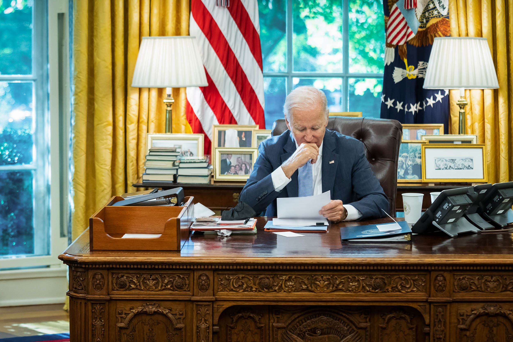

**
Президенту США
**
**
Joseph R. Biden Jr.
**
**
The White House
**
**
1600 Pennsylvania Avenue NW
**
**
Washington, DC 20500
**

**
Уважаемый господин Президент!
**

&emsp;&emsp;Вот уже 63 года президенты США объявляют Неделю порабощенных народов, что свидетельствует о приверженности и защите Соединёнными Штатами фундаментальных прав, свобод, ценностей и принципов, провозглашаемых ООН – свободы, демократии, права наций на сохранение, развитие и самоопределение.

&emsp;&emsp;Год 2022 продемонстрировал, что отказываться от идей борьбы за свободу и освобождение народов от колониальной зависимости и власти репрессивных режимов ещё не время. 
Москва предприняла полномасштабное вторжение в Украину, ведущую борьбу против российской агрессии и оккупации уже на протяжении восьми лет. Кремль прилагает огромные усилия, чтобы оккупировать Украину и поработить украинский народ, который только в ХХ веке 4 раза провозглашал свою независимость (1918, 1939, 1941, 1991) и колоссальными человеческими жертвами подкреплял свое стремление к образованию независимого государства. Сегодня украинская нация борется за сохранение своего национального государства и свободное развитие, в праве на что отказывает нынешняя российская власть, установившая в своей стране полноценный реакционный фашистский режим.

&emsp;&emsp;Украинцы, сами вырвавшиеся из объятий империи в 1991 году, прекрасно осознают, чем грозит им возвращение к прошлому. У них перед глазами трагический пример в виде безмолвных солдат, порабощенных Россией народов, которых путинский режим безжалостно обрекает на гибель в условиях войны, которая противоречит всем международным правовым нормам. Развязанная Кремлем война напоминает нам истинное значение слов “свобода” и “собственное государство”. Украинцы сражаются за свою свободу и своё государство. Порабощенные же народы – принуждаются воевать за интересы поработившего их чужого государства и за сохранение власти в России в руках узурпировавшей её криминальной мафиозной верхушки. Извращенная логика ситуации в том, что эти нерусские солдаты проливают свою кровь ради того, чтобы отнять свободу у украинцев, которым, в отличие от их народов, посчастливилось получить её в процессе многовековой борьбы против России.

&emsp;&emsp;Большая часть территории нынешней России – это завоеванные, оккупированные полностью или частично земли многих десятков государств и сотен народов: Казанское ханство, Астраханское ханство, земли и государства народов Северного Кавказа, Карелия, Эрзянь Мастор, Бурят-Монголия, Калмыцкое ханство, земли ногайцев, адыгов, народов Сибири и Дальнего Востока. На захваченных Москвой территориях осуществляется самая обычная колониальная политика эксплуатации природных ресурсов: добываются углеводороды, руды черных, цветных и редкоземельных металлов, драгоценные камни, многие десятки химических элементов, земля, лес, животный мир, и иные ресурсы на сотни миллиардов долларов ежегодно. Все богатства забирает себе Москва. На эти деньги содержится административный и репрессивный аппарат имперского, репрессивного по характеру российского государства, силовые органы, армия, русская культура и система образования. Население оккупированных земель получает из этого денежного потока самый мизер, которого не хватает даже на текущие нужды нерусских народов РФ.

&emsp;&emsp;Доступная статистика погибших на войне демонстрирует непропорционально высокие показатели жертв среди представителей национальных республик РФ – как в абсолютном выражении, так и в пересчете на душу населения. Потеря значительного количества молодых мужчин в результате военной агрессии России несет особую опасность для малочисленных народов, чье будущее как уникальных этнических и культурных сообществ и без этого находится под угрозой исчезновения.

&emsp;&emsp;Но война – не единственная и даже не главная проблема нерусских народов в государстве Путина. Их национальные права, предусмотренные международными установлениями (ООН, Европа) и Конституцией Российской Федерации, постоянно нарушаются. Государственные языки республик целенаправленно вытесняются русским из сферы образования и из общественной жизни вообще. Национальные и региональные партии запрещены. Республики теряют полномочия, права и свободы, гарантированные им Конституцией и федеративными договорами между ними и Москвой. Национальные НКО закрываются с подачи властей и спецслужб. Активисты национальных движений в России преследуются государственными органами, подвергаются репрессиям и анонимным расправам в гораздо большей мере, нежели известные деятели центральной российской оппозиции.

&emsp;&emsp;По факту большинство граждан нерусских национальностей в России дискриминируются, ограничиваются в гражданских правах и подвергаются систематическим оскорблениям. Россия в результате политики путинского режима перестала быть Федерацией, превратившись в централизованное государство, где почти все вопросы региональной и местной жизни решаются в далёкой Москве. Компетенция принятия решения по большей части вопросов, в т.ч. внутреннего развития национальных республик и территорий, а также сохранения и развития нерусских народов, принадлежит, так называемому, федеральному центру. Все права по регулированию, распоряжению и управлению законодательной и нормативной сферой, бюджетными средствами, пользованием землёй, недрами, основными природными ресурсами – принадлежат российской власти в Москве, а не республикам.

&emsp;&emsp;На огромных территориях нерусские народы были порабощены, вытеснены, сведены до жалкого подавляющего меньшинства или просто уничтожены. На этих территориях население ассимилировано и/или заменено на русских и представителей других славянских народов (финно-угорский Север, Кубань, земли донских казаков, Поволжье, Сибирь, Крайний Север, Прибайкалье, Дальний Восток). Всё это происходило не естественным путём, а в результате целенаправленной политики преимущественно Русского государства в разных его формах – Московского княжества, Московии, Российской империи, СССР, Российской Федерации.

&emsp;&emsp;Каждый порабощенный народ, проживающий на своих исконных землях в составе Российской Федерации, постоянно что-то терял и продолжает терять – численность, территорию, язык, культурные особенности, самоуправление, природные ресурсы, безопасность и так далее. Глядя, как процветают национальные культуры, экономика и демократия в обретших свободу республиках бывшего Советского Союза, мы приходим к заключению, что лишь подлинный суверенитет способен спасти наши народы от ассимиляции и полного исчезновения.

&emsp;&emsp;Разделяя ценности современной демократии,

&emsp;&emsp;ощущая сопричастность к целям Недели порабощенных народов,

&emsp;&emsp;желая достойного будущего нашим потомкам,

&emsp;&emsp;мы представители национальных движений порабощенных Россией народов, обращаемся к вам со следующими просьбами:

1.	поддержать порабощенные Россией народы в реализации их права на самоопределение;
2.	осудить проведение политики Кремля по ассимиляции и аккультурации порабощенных Россией народов;
3.	требовать от путинского режима прекратить преследование национальных активистов и немедленно освободить всех политических заключённых;
4.	признать недра и природные богатства на родине порабощенные Россией народов их национальным достоянием;
5.	осудить использование империей представителей малочисленных нерусских народов в чужой им войне;
6.	предусмотреть санкции в отношении российских должностных лиц нарушающих права малочисленных нерусских народов в России;
7.	ввести в текст закона Public Law 86-90 Captive Nations Week Resolution наименования несвободных порабощенных Россией нерусских народов, список которых мы готовы представить отдельно;
8.	Рассмотреть возможность организации и проведения Международного трибунала над коммунизмом.

***
Свободу людям! Свободу народам!
***

**С уважением,**

**представители национальных движений:**

башкирского – Руслан Габбасов,

бурятского – Доржо Дугаров, Раджана Дугар-Де Понте,

казачьего – Вячеслав Демин,

калмыцкого – Владимир Довданов, Батыр Боромангнаев, Эренцен Доляев, Альберт Шарапов

ногайского – Эдиге Бекмурзаев,

татарского – Рафис Кашапов,

эрзянского – Сыресь Боляень, Виталий Ромашкин, Геньо Марконь,

