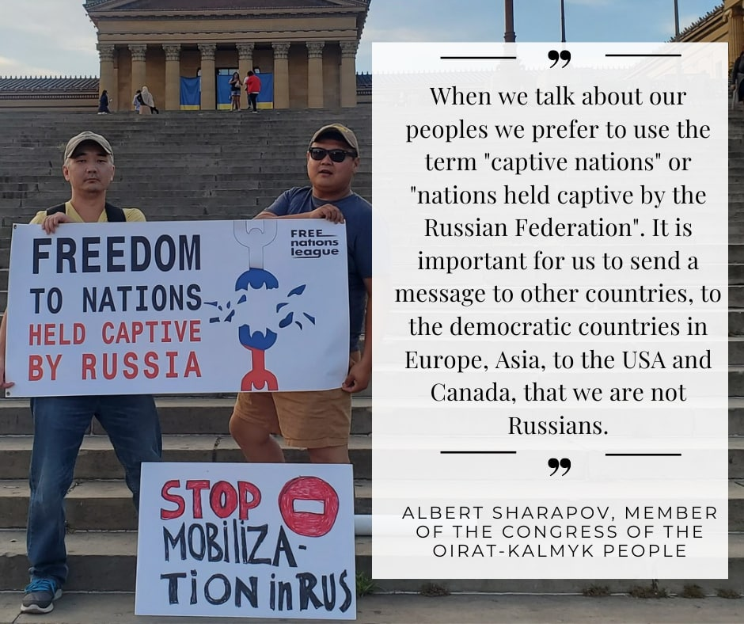

Насколько развито освободительное движение коренных народов в Российской Федерации? В чем должна заключаться помощь цивилизованного мира этим движениям?

Как человек, активно участвующий в освободительном движении и наблюдающий за его развитием изнутри, я могу ответить на эти вопросы.

Когда мы говорим о наших народах, мы предпочитаем использовать термин «пленные народы» или «народы, находящиеся в плену у Российской Федерации». Нам важно донести до других стран, демократических стран Европы, Азии, США и Канады, что мы не русские. У каждой порабощенной нации есть история борьбы за независимость в 20-м веке.

Война на Украине открывает перед нашими народами возможность отделиться от России, создать собственные независимые демократические государства и стать местом, где наши народы могут жить мирно и процветать. Такие возможности уже были в истории. Когда Российская империя рухнула, мы ошиблись, поверив коммунистам, и попали в рабство на многие десятилетия. Вы знаете, среди этих обманутых и порабощенных народов была и Украина. Когда распался Советский Союз, у нас снова отняли свободу. Геноцидной войной против свободолюбивого чеченского народа Россия продемонстрировала другим народам, на что они могут рассчитывать, если будут стремиться к свободе. На этот раз мы не хотим ошибиться и упустить шанс. Для этого наши народы создали Лигу свободных наций – организацию, главной целью которой является создание независимых национальных государств на месте Российской Федерации и недопущение возрождения русского фашистского государства.

Мы верим, что помощь нам, порабощенным народам, принесет пользу всему миру.

Нерусские народы хотят быть увиденными и услышанными. Пожалуйста, начните говорить с народами, находящимися в плену у Российской Федерации. Они оценят ваше обращение к ним напрямую, примут вашу поддержку и начнут действовать. С вашей моральной помощью порабощенные народы могут разобрать Россию изнутри и встать на путь исторических преобразований, как это сделали другие народы после падения Берлинской стены. Новые страны сделают мир богаче. Люди откроют для себя новые места с уникальной природой, кухней и культурой.

Когда цивилизованный мир ведет дискуссии с так называемыми «хорошими русскими», он должен понимать, что этих московских политиков, либералов с империалистическим складом ума, финансируют российские олигархи. Они могут заменить Путина, но они не могут изменить Россию, потому что их интерес состоит только в том, чтобы сохранить свое богатство и продолжать грабить колонии. Россия обречена подавлять нерусские народы и становиться империей снова и снова.

Давайте разорвем этот порочный круг!