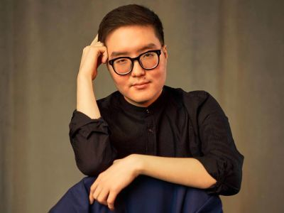

<head>
  <title>Они хотят вернуться в 23-е февраля</title>
  <meta
    name="description"
    content="Даавр Доржин: лучше я буду 'с маргиналами и бунтарями'. Такое освещение форума The Imperial Russia и весь дискурс критики регионалистского движения свидетельствует о нескольких принципиальных тезисах, которыми руководствуются так называемые 'хорошие русские'"
    key="desc"
  />
  <meta
    property="og:description"
    content="Даавр Доржин: лучше я буду 'с маргиналами и бунтарями'. Такое освещение форума The Imperial Russia и весь дискурс критики регионалистского движения свидетельствует о нескольких принципиальных тезисах, которыми руководствуются так называемые 'хорошие русские'"
  />
  <meta
    name="twitter:description"
    content="Даавр Доржин: лучше я буду 'с маргиналами и бунтарями'. Такое освещение форума The Imperial Russia и весь дискурс критики регионалистского движения свидетельствует о нескольких принципиальных тезисах, которыми руководствуются так называемые 'хорошие русские'"
  />
</head>

#### *Даавр Доржин: лучше я буду "с маргиналами и бунтарями"*

Здравствуйте, уважаемые читатели! Меня зовут Даавр, и я ойрат. От имени Конгресса ойрат-калмыцкого народа я выступил спикером на конференции *The Imperial Russia*, организованной фракцией "Европейские консерваторы и реформаторы" в Европейском парламенте и Форумом свободных народов ПостРоссии. В кулуарах наблюдались журналисты из рукопожатных медиа "общероссийской повестки", которые с угрюмыми лицами что-то бешено строчили в своих ноутбуках. В минувшую пятницу почти одновременно вышло сразу несколько материалов (в "Новой Газете Европа", Meduza, "Дожде" и так далее) о конференции, общая тональность которых сводилась к морализаторству в адрес спикеров и повестки дезинтеграции России. Где-то использовались и совсем уж странные пассажи: так, башкорт Руслан Габбасов был назван "немолодым лысеющим мужчиной в очках" в репортаже под авторством Ильи Азара, как раз-таки немолодого лысеющего мужчины в очках. Самый честный из членов Команды Навального Владимир Милов, который не кривит душой и выкладывает все, что в голове крутится (а крутится там далеко не самое лицеприятное и гуманное), записал большой ролик о том, что Россия развалиться не может. Для меня такое освещение форума *The Imperial Russia* и весь дискурс критики регионалистского движения свидетельствует о нескольких принципиальных тезисах, которыми руководствуются так называемые "хорошие русские" и которые нужно учитывать при взаимодействии с ними.

#### Тезис №1. Они действительно верят в Россию "от Калининграда до Владивостока".

Советский гимн гласил, что народы, покорённые имперскими властями, большевиками и коммунистами, *"сплотила навеки Великая Русь"*. Политики и общественные деятели "общероссийской повестки" (для краткости используем термин "общеросы") считают всё пространство Российской Федерации этнически гомогенной ("везде живут русские"), экономически правильно выстроенной и не подлежащей дезинтеграции территорией. В их восприятии Россия – это единый фрейм, а люди, живущие в Брянске, Петрозаводске, Элисте и Кызыле, один народ. Чем это отличается от концепции позднего путинизма в отношении Украины и Беларуси, неясно. Кроме того, общеросы Москвы и Петербурга уверены, что только они, их мудрость и непреклонность, а также готовность применить репрессии спасает нас, нерусских, якобы нецивилизованных дикарей, от тотальной резни *omnium contra omnes*. Будто бы мы неспособны к договорённостям, будто бы мы не способны к созданию своих государственностей. Такой вот политический примордиализм.

#### Тезис №2. Они стигматизируют нас, потому что не могут определиться с отношением к нашим проблемам.

Риторика упомянутых выше материалов аксиоматична, агрессивна и во многом касается личностей, а не борьбы с повесткой. Надо отметить, что далеко не все активисты и движения национального толка имеют в программных целях отделение от России. Например, присутствовавший на форуме представитель ительменов призывал защищать коренной образ жизни его народа, на который посягает одуревший бизнес московской метрополии, нарушающий все возможные экологические стандарты. Тем не менее, общеросы пытаются стереть наши отличия и создать из нас что-то единое и удобное для стигматизации и обструкции; как это отличается от пропагандистского штампа "русофоба" или "русореза", опять-таки не ясно. Забавно лишь то, что никакого ответа относительно национального вопроса в повестке самих общеросов (Команда Навального, МБХ и так далее), по сути, нет. Всё должно решить "парламентское правление". Правда, как вот обеспечить, чтобы права тех же ительменов учитывались в общероссийском парламенте, ответа пока что никто не дал. Могу предположить, что о праве вето для них в формате Европейского Совета, где с Польшей, Литвой и другими государствами вынуждены вести из-за этого обширные переговоры крупнейшие державы вроде Франции и Германии, и речи быть для общеросов не может.

#### Тезис №3. Они мечтают вернуться в 23 февраля 2022 г.

Как ни крути, но это правда. Об этом я подумал в разговоре с Ахмедом Закаевым, лидером Ичкерии. Страшная магия цифр: 23-е февраля – это ещё и дата Геноцида чеченцев и ингушей. По-хорошему, в российском дискурсе позднего путинизма общеросов устраивало многое: Сибирь и Дальний Восток под эффективным московским контролем, актив Ичкерии либо уничтожен, либо изгнан, а в системе остаются "либералы", которые могут стать точкой для пресловутого "раскола элит". Президента России хвалили за эффективные реформы первых лет правления (налоговую, земельную), а за борьбу с "сепаратизмом" – уважали. Якобы достаточно отправить Путина в отставку, провести несколько задержаний и отъёмов активов, и вперёд – строить Великую и Свободную Россию. Более того, положа руку на сердце не каждый из тех, кого принято считать русским либеральным рукопожатным демократом, твёрдо правильно ответит на вопрос "чей Крым?"; там обязательно будут условия наподобие "нет, ну, там же люди проголосовали" или "если мы его отдадим, это вызовет у русских ресентимент". А вот 23-го числа можно было спокойно воспринимать временно оккупированные территории как российские, можно было рассуждать о "повторном референдуме" и даже "невозможности вернуть его обратно". Иначе говоря, нет у общеросов понимания, что прошлого больше не будет. Проекту России давали много шансов и в Европе, и в США. Я помню проекты Европы "от Лиссабона до Владивостока", поддержку российской экономики, перспективы безвиза и прочие штуки глобальной экономической интеграции. Самое страшное для общеросов, пожалуй, это то, что они не могут доказать их право на ещё один шанс, на модернизацию, демократизацию и сохранение России как геополитической реальности. Некоторые совсем искренние общеросы уже обвиняют "коллективный Запад", что именно он виноват в путинизме. Как это отличается от государственной пропаганды и его обвинений "коллективного Запада", вновь не ясно.

Поэтому наилучшей тактикой для всех нас, полагаю, будет разумное игнорирование их оскорблений. Нам следует сконцентрироваться на следующем: улучшении собственной повестки, адаптации её под новые реалии; формировании связей с иностранным миром, обретении нами политической субъектности; и, наконец, создании образа будущего для наших народов и наций. В конце концов, в 1984-м вряд ли кто-то в советских республиках воспринимал народные движения и их лидеров иначе как маргиналов и бунтарей. Их либо убивали, либо они сидели в лагерях КГБ. А потом эти люди, находясь в меньшинстве, победили российский империализм советского разлива. Если ещё одна победа над этим врагом "выгодна Путину и Кремлю", то лучше я буду "с маргиналами и бунтарями".

***Даавр Доржин, член Конгресса ойрат-калмыцкого народа***