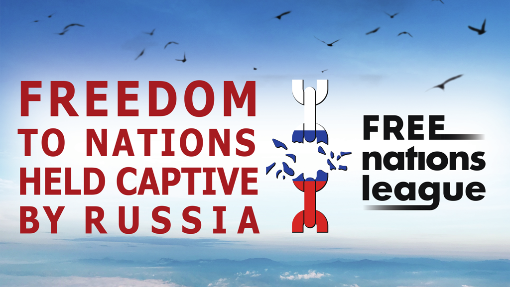

# Активісти національних рухів поневолених Росією народів вийдуть на мітинги у різних країнах з метою консолідації антиімперських сил.

23 липня Ліга Вільних націй, що згуртувала представників поневолених Кремлем народів, проведе мирні вуличні акції.

Ні війні! Геть Імперію! Волю народам! Під цими гаслами ми виходимо на вулиці міст різних країн світу.

Ми просимо уряди демократичних країн підтримати право народів у Російській Федерації на самовизначення. Право на відновлення незалежності та  створення власних держав. Право, що в нас відняли силою!

м. Вільнюс – Кафедральна площа, 14:00. Литва, 
 
м. Філадельфія – EST Philadelphia Museum of Art, 2:00 PM. США, 
 
м. Клівленд – Cleveland Downtown “Free Stamp”. 2:00 PM. США,
 
м. Нью-Йорк – місто і час  визначається. 

м. Анталія – Fener, Tekelioğlu Cd. No:55. Площа перед ТЦ "TerraCity", 17:00. Туреччина,

м. Прага - OREA Hotel Pyramida Praha, вул. Bělohorská 24, 14:00. Чехія

Ми закликаємо вийти на головні площі ваших міст з вимогою надання суверенітету народам на території Російської Федерації. Якщо Ви готові виступити організатором акції у Вашому місті – напишіть нам: lfn.feedback@gmail.com

***Волю народам! Волю людині!***

